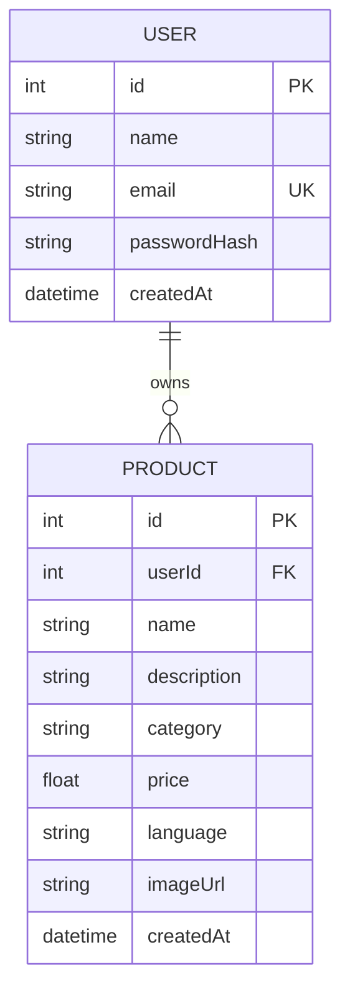

# Design Document: Digital Catalog Agent

## Overview

This design document outlines the architecture for a full-stack web application called "Digital Catalog Agent" targeting small retailers and artisans in India. The application enables users to create digital product catalogs using voice, text, or photos in their local language.

The system consists of:
- A React frontend with Tailwind CSS for responsive, mobile-first UI
- A Node.js/Express backend with REST API
- SQLite database (PostgreSQL-ready) with Prisma ORM
- JWT-based authentication
- Mock AI endpoint for product generation

## Architecture

### System Architecture

```mermaid
graph TB
    subgraph Frontend
        A[React App] --> B[Pages]
        A --> C[Components]
        A --> D[API Client]
        B --> B1[Landing]
        B --> B2[Auth]
        B --> B3[Dashboard]
        B --> B4[Demo]
    end
    
    subgraph Backend
        E[Express Server] --> F[Routes]
        E --> G[Middleware]
        E --> H[Controllers]
        F --> F1[/api/auth]
        F --> F2[/api/products]
        F --> F3[/api/demo]
        F --> F4[/api/ai]
        G --> G1[Auth Middleware]
        G --> G2[Validation]
    end
    
    subgraph Database
        I[SQLite/PostgreSQL]
        J[Prisma ORM]
    end
    
    D --> E
    H --> J
    J --> I
```

### Technology Stack

**Frontend:**
- React 18 with React Router
- Tailwind CSS for styling
- Axios for API calls
- React Hook Form for form handling
- Lucide React for icons

**Backend:**
- Node.js 18+
- Express.js
- Prisma ORM
- SQLite (dev) / PostgreSQL (prod)
- JWT (jsonwebtoken)
- bcrypt for password hashing
- multer for file uploads

### File Structure

```
/
├── client/                    # React frontend
│   ├── src/
│   │   ├── components/        # Reusable UI components
│   │   │   ├── ui/           # Base UI components
│   │   │   ├── layout/       # Layout components
│   │   │   └── forms/        # Form components
│   │   ├── pages/            # Page components
│   │   │   ├── Landing.jsx
│   │   │   ├── Login.jsx
│   │   │   ├── Signup.jsx
│   │   │   ├── Dashboard.jsx
│   │   │   ├── AddProduct.jsx
│   │   │   └── Demo.jsx
│   │   ├── hooks/            # Custom hooks
│   │   ├── context/          # React context (auth)
│   │   ├── api/              # API client functions
│   │   ├── utils/            # Utility functions
│   │   ├── App.jsx
│   │   ├── main.jsx
│   │   └── index.css
│   ├── public/
│   ├── package.json
│   └── tailwind.config.js
│
├── server/                    # Express backend
│   ├── src/
│   │   ├── routes/           # API routes
│   │   │   ├── auth.js
│   │   │   ├── products.js
│   │   │   ├── demo.js
│   │   │   └── ai.js
│   │   ├── controllers/      # Route handlers
│   │   ├── middleware/       # Express middleware
│   │   │   ├── auth.js
│   │   │   └── validation.js
│   │   ├── services/         # Business logic
│   │   ├── utils/            # Utilities
│   │   └── index.js
│   ├── prisma/
│   │   ├── schema.prisma
│   │   └── seed.js
│   ├── uploads/              # Uploaded images
│   └── package.json
│
├── package.json              # Root package.json
└── README.md
```

## Components and Interfaces

### Frontend Components

#### Pages

1. **Landing Page** (`/`)
   - Hero section with CTAs
   - Problem/Solution sections
   - Navigation to auth and demo

2. **Login Page** (`/login`)
   - Email/password form
   - Link to signup
   - Error display

3. **Signup Page** (`/signup`)
   - Name, email, password, confirm password
   - Validation feedback
   - Link to login

4. **Dashboard Page** (`/dashboard`)
   - Protected route
   - Product list (table/grid)
   - Add Product button
   - Export Catalog button (placeholder)

5. **Add/Edit Product Page** (`/products/new`, `/products/:id/edit`)
   - Product form with all fields
   - AI generation section
   - Image upload with preview

6. **Demo Page** (`/demo`)
   - Public access
   - Sample product grid
   - Explanatory text

#### Reusable Components

```jsx
// UI Components
Button          // Primary, secondary, outline variants
Input           // Text input with label and error
Select          // Dropdown with options
Textarea        // Multiline input
Card            // Container with shadow and rounded corners
Alert           // Success, error, info messages
Modal           // Dialog overlay
Spinner         // Loading indicator

// Layout Components
Navbar          // Navigation header
Footer          // Page footer
Container       // Max-width wrapper
ProtectedRoute  // Auth guard wrapper

// Form Components
ProductForm     // Complete product form
LoginForm       // Login form
SignupForm      // Signup form

// Feature Components
ProductCard     // Single product display
ProductGrid     // Grid of product cards
ProductTable    // Table view of products
AIGenerator     // AI prompt and generate button
ImageUpload     // File upload with preview
```

### Backend API Endpoints

```
Authentication:
POST   /api/auth/signup     - Create new user
POST   /api/auth/login      - Authenticate user, return JWT
GET    /api/auth/me         - Get current user (protected)

Products (Protected):
GET    /api/products        - List user's products
POST   /api/products        - Create product
GET    /api/products/:id    - Get single product
PUT    /api/products/:id    - Update product
DELETE /api/products/:id    - Delete product

Demo (Public):
GET    /api/demo/products   - Get demo catalog

AI (Public):
POST   /api/ai/generate-product - Generate mock product data
```

### API Request/Response Interfaces

```typescript
// Auth
interface SignupRequest {
  name: string;
  email: string;
  password: string;
  confirmPassword: string;
}

interface LoginRequest {
  email: string;
  password: string;
}

interface AuthResponse {
  token: string;
  user: {
    id: number;
    name: string;
    email: string;
  };
}

// Products
interface CreateProductRequest {
  name: string;
  description: string;
  category: 'Grocery' | 'Clothing' | 'Handicraft' | 'Electronics' | 'Other';
  price: number;
  language: 'English' | 'Hindi' | 'Tamil' | 'Telugu' | 'Kannada' | 'Bengali';
  image?: File;
}

interface ProductResponse {
  id: number;
  userId: number;
  name: string;
  description: string;
  category: string;
  price: number;
  language: string;
  imageUrl: string | null;
  createdAt: string;
}

// AI Generation
interface AIGenerateRequest {
  promptText: string;
  language: string;
}

interface AIGenerateResponse {
  name: string;
  description: string;
  category: string;
}
```

## Data Models

### Prisma Schema

```prisma
model User {
  id           Int       @id @default(autoincrement())
  name         String
  email        String    @unique
  passwordHash String
  createdAt    DateTime  @default(now())
  products     Product[]
}

model Product {
  id          Int      @id @default(autoincrement())
  userId      Int
  user        User     @relation(fields: [userId], references: [id], onDelete: Cascade)
  name        String
  description String
  category    String
  price       Float
  language    String
  imageUrl    String?
  createdAt   DateTime @default(now())
}
```

### Entity Relationship Diagram



## Correctness Properties

*A property is a characteristic or behavior that should hold true across all valid executions of a system-essentially, a formal statement about what the system should do. Properties serve as the bridge between human-readable specifications and machine-verifiable correctness guarantees.*

### Property 1: Authentication Round-Trip
*For any* valid user credentials (email and password), signing up and then logging in with those credentials SHALL return a valid JWT token that can be used to access protected resources.
**Validates: Requirements 2.1, 2.4, 2.6, 7.1, 7.2**

### Property 2: Password Mismatch Validation
*For any* signup attempt where password and confirmPassword fields differ, the system SHALL reject the request and return a validation error.
**Validates: Requirements 2.2**

### Property 3: Duplicate Email Prevention
*For any* signup attempt with an email that already exists in the database, the system SHALL reject the request and return an appropriate error.
**Validates: Requirements 2.3**

### Property 4: Invalid Credentials Rejection
*For any* login attempt with credentials that don't match a valid user, the system SHALL reject the request without revealing which field (email or password) is incorrect.
**Validates: Requirements 2.5**

### Property 5: Product CRUD Persistence
*For any* valid product data, creating a product and then retrieving it SHALL return the same data that was submitted (round-trip consistency).
**Validates: Requirements 4.1, 4.6, 7.4, 7.5, 8.2**

### Property 6: Product Ownership Isolation
*For any* authenticated user, the GET /api/products endpoint SHALL return only products where userId matches the authenticated user's id.
**Validates: Requirements 3.1, 7.3**

### Property 7: Authorization Enforcement
*For any* request to a protected endpoint without a valid JWT token, the system SHALL return a 401 Unauthorized response.
**Validates: Requirements 3.5, 7.9**

### Property 8: Product Deletion Consistency
*For any* product that is deleted, subsequent GET requests for that product SHALL return a 404 Not Found response.
**Validates: Requirements 4.7, 7.6**

### Property 9: Price Validation
*For any* product creation or update request with price <= 0, the system SHALL reject the request with a validation error.
**Validates: Requirements 4.9**

### Property 10: Required Fields Validation
*For any* product creation request missing required fields (name, description, category, price, language), the system SHALL reject the request with specific validation errors for each missing field.
**Validates: Requirements 4.8**

### Property 11: Password Hashing
*For any* user stored in the database, the passwordHash field SHALL NOT equal the original plain text password.
**Validates: Requirements 8.4**

### Property 12: AI Generation Response Structure
*For any* request to the AI generation endpoint with valid promptText and language, the response SHALL contain name, description, and category fields.
**Validates: Requirements 5.2, 7.8**

### Property 13: Product Display Completeness
*For any* product displayed in the UI (dashboard or demo), the display SHALL include name, category, price, description, and language tag.
**Validates: Requirements 3.2, 6.2**

### Property 14: Touch Target Accessibility
*For any* interactive element (button, input, link) in the UI, the element SHALL have minimum dimensions of 44x44 pixels.
**Validates: Requirements 9.1**

### Property 15: User Cascade Deletion
*For any* user deletion, all products associated with that user SHALL also be deleted from the database.
**Validates: Requirements 8.3**

## Error Handling

### Frontend Error Handling

1. **Form Validation Errors**
   - Display inline error messages below each invalid field
   - Highlight invalid fields with red border
   - Show summary at top of form if multiple errors

2. **API Errors**
   - Display toast/alert with user-friendly message
   - Log technical details to console (dev only)
   - Provide retry option where appropriate

3. **Network Errors**
   - Display "Please check your internet connection" message
   - Show offline indicator in navbar
   - Queue actions for retry when online

4. **Authentication Errors**
   - Redirect to login on 401 responses
   - Clear stored token on auth failure
   - Show "Session expired" message

### Backend Error Handling

1. **Validation Errors (400)**
   ```json
   {
     "error": "Validation failed",
     "details": {
       "email": "Invalid email format",
       "password": "Password must be at least 8 characters"
     }
   }
   ```

2. **Authentication Errors (401)**
   ```json
   {
     "error": "Invalid credentials"
   }
   ```

3. **Authorization Errors (403)**
   ```json
   {
     "error": "You don't have permission to access this resource"
   }
   ```

4. **Not Found Errors (404)**
   ```json
   {
     "error": "Product not found"
   }
   ```

5. **Server Errors (500)**
   ```json
   {
     "error": "Something went wrong. Please try again later."
   }
   ```

## Testing Strategy

### Dual Testing Approach

The application will use both unit tests and property-based tests for comprehensive coverage.

### Unit Testing

**Framework:** Jest + React Testing Library (frontend), Jest + Supertest (backend)

**Frontend Unit Tests:**
- Component rendering tests
- Form validation behavior
- Navigation and routing
- API client functions
- Auth context behavior

**Backend Unit Tests:**
- Route handler responses
- Middleware behavior
- Validation functions
- Service layer logic

### Property-Based Testing

**Framework:** fast-check with Jest

Property-based tests will verify universal properties:

1. **Auth Round-Trip**: Generate random valid credentials, verify signup → login → access flow
2. **Password Mismatch**: Generate password pairs where p1 !== p2, verify rejection
3. **Product CRUD**: Generate random products, verify create → read consistency
4. **Ownership Isolation**: Generate multiple users with products, verify isolation
5. **Authorization**: Generate requests without tokens, verify 401 responses
6. **Price Validation**: Generate prices <= 0, verify rejection
7. **Password Hashing**: Generate passwords, verify hash !== plaintext

### Test Configuration

- Property tests: Minimum 100 iterations per property
- Each property test tagged with: `**Feature: digital-catalog-landing, Property {N}: {description}**`

### Integration Testing

- API endpoint integration tests with test database
- Frontend-backend integration with MSW (Mock Service Worker)

### E2E Testing (Optional)

- Playwright or Cypress for critical user flows
- Signup → Login → Add Product → View Dashboard
